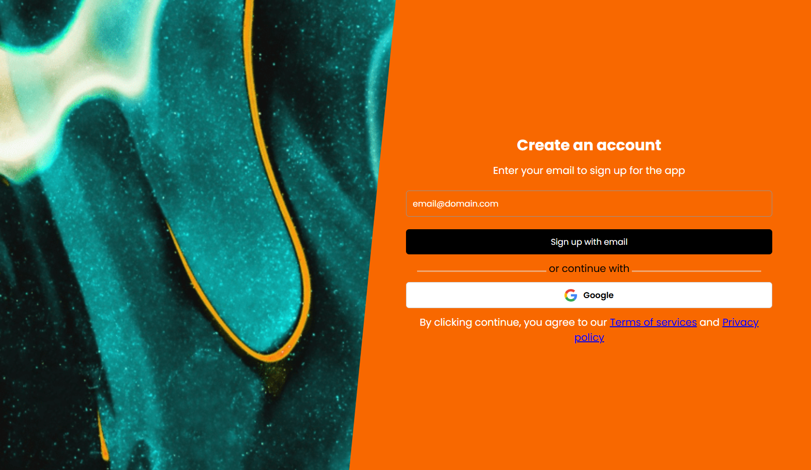

# Sign-In Page UI

A modern and responsive **Sign-In Page** built for web applications. This component is designed to onboard users with a clean, intuitive interface and multiple authentication options.

## ✨ Features

- Email-based sign-up with validation
- Google OAuth integration
- Terms of Service and Privacy Policy disclaimer
- Split-screen layout with abstract design and vibrant color palette
- Fully responsive for mobile and desktop

## 📸 Preview

 

## 🛠️ Tech Stack

- HTML
- CSS
- JavaScript / React
- Google OAuth API

## 🚀 Getting Started

1. Clone the repository:
   ```bash
  git clone https://github.com/mimipug/signin-page.git
   cd signin-page

